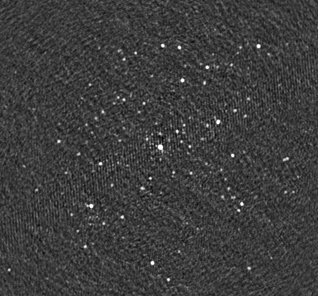
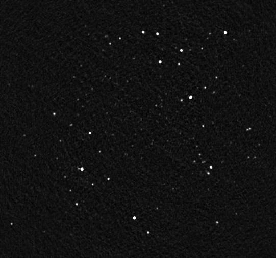

Self Calibation Tutorial
========================

Introduction
^^^^^^^^^^^^

This tutorial will guide you through the most common steps in self calibration. This involves calibration along one or more directions. Automatically this will cover calibration on a fixed sky model (e.g., for the LOFAR EoR KSP) as this is a single step in the self-calibration process.

Selfcal
^^^^^^^
We will demonstrate selfcal using the SAGECal executable for a GPU - sagecal_gpu - built with cmake, but instructions are, of course, similar for the containerized version of sagecal_gpu. Building sagecal will also automatically build buildsky and create_clusters.py, which we need for self-calibration.

After you have cloned, built and installed SAGECal - e.g., in a directory called "install" - from the top level directory in the cloned repo, do:

::

   cd test/Calibration

and download an initial, coarse, sky model from SkyView_ to calibrate our small observation sm.ms - provided with sagecal repo - of 3C196.  
Enter "3C196" in the "Coordinates or Source" field and select "TGSS ADR1" from the "Radio: MHz:" window. Otherwise, use default values for donwloading the FITS image. For some reason SkyView will not provide a SIN projected image from TGSS, but you can get these by downloading from the `TGSS archive`_ directly. For now, a TAN projected image will suffice, because we only need the central source.

.. _skyview: https://skyview.gsfc.nasa.gov/current/cgi/query.pl
.. _`TGSS archive`: https://vo.astron.nl/tgssadr/q_fits/cutout/form
 
To extract the sky model from SkyView image - let's call it skyview-image.fits - we will use Duchamp_. This three-dimensional source finder is most easily installed - after downloading and extracting the source code tar archive - using

::

   ./configure --prefix=/my/favorite/install/dir
   make
   make install

However, you may run into a missing "wcslib/cpgsbox.h" error. This can be solved by reconfiguring:

::

   ./configure --without-pgplot --prefix=/my/favorite/install/dir

Next, we need to supply Duchamp with a configuration file to extract a sky model from the FITS image. You can use this minimal configuration file:

:: 

   ##########################################
   imageFile       skyview-image.fits
   logFile         logfile.txt
   outFile         results.txt
   spectraFile     spectra.ps
   minPix          5
   snrRecon        10.
   flagKarma 1
   karmaFile duchamp.ann
   flagnegative 0
   flagMaps 0
   flagOutputMask 1
   flagMaskWithObjectNum 1
   flagXOutput 0
   ############################################

which we call my-Duchamp-conf.txt.

Simply run it like this:

::

   Duchamp -p my-Duchamp-conf.txt 

.. _Duchamp: https://www.atnf.csiro.au/people/Matthew.Whiting/Duchamp/

Now build the sky model using the mask file skyview-image.MASK.fits we just obtained:

::

   /path/to/buildsky -f skyview-image.fits -m skyview-image.MASK.fits -o 1 -a 25 -b 25 -p 0

This will create a sky model file skyview-image.fits.sky.txt, in `LSM format`_, making use of the clean beam size of the TGSS ADR1, which erroneously is not provided in the header of this particular SkyView image, but can be found in the `survey paper`_.

.. _`survey paper`: https://arxiv.org/abs/1603.04368

.. _`LSM format`: https://github.com/nlesc-dirac/sagecal/blob/master/README.md#2c-sky-model-format 

From this, we need to construct a cluster file, which determines the directions for which we seek calibration solutions. src/buildsky/create_clusters.py can be used to construct such a file by setting the number of clusters for a given sky model. It is a Python 3 script that requires the source model to be in LSM format. Thankfully, we have run buildsky in the appropriate manner.

::

   /path/to/create_clusters.py -s skyview-image.fits.sky.txt -c -1 -o skyview-image.fits.sky.txt.cluster -i 10

This will produce a cluster file skyview-image.fits.sky.txt.cluster with just one cluster, which will not be subtracted, because it will get a negative cluster id (-1). The two separate sources shown in the SkyView/TGSS image of 3C196 are separated by 3-4', so much less than the size of the isoplanatic patch at our observing frequency (153 MHz). A maximum of 10 iterations was set, but 2 were enough. Now calibrate our data on this sky model, optionally making use of GPU power.

::   

   module load openblas cuda91 casacore/2.3.0-gcc-4.9.3 (or a similar instruction, if necessary)
   ../../install/bin/sagecal_gpu -d sm.ms -s skyview-image.fits.sky.txt -c skyview-image.fits.sky.txt.cluster -n 40 -t 1 -p sm.ms.solutions -a 0 -e 4 -F 1 -j 2 -k -1 -B 1 -E 1  > sm.ms.output

The "-t 1" means that we have chosen a solution interval equal to one time sampling interval of the sm.ms observation. Also, we have used 40 CPU threads; optimally, this value coincides with the number of logical cores of your CPU. 
And we have "-k -1" to apply our calibration solution for cluster number -1, which, as mentioned before, will not be subtracted because of its negative id.

   
These and other arguments are explained when you run 

::

   ../../install/bin/sagecal_gpu -h

(or check the manua). This will also show you other options for "-j". "-j 5" uses a robust Riemannian trust region (RRTR), which is much faster than "-j 2" (OSRLM = Ordered Subsets Accelerated Robust Levenberg Marquardt). The downside from using RRTR is that it will only work properly if the power level of the visibilities that you are calibrating matches the power level of the sky model that you are using. If this is not the case, rounding errors may prevent you from finding accurate solutions. Use this Python 2 script - Scale.py - to scale your visibilities and write the output to the same column:

::

   #!/usr/bin/env python2
   import pyrap.tables as pt
   import string
   def read_corr(msname,scalefac):
       tt=pt.table(msname,readonly=False)
       c=tt.getcol('DATA')
       tt.putcol('DATA',c*scalefac)
       tt.close()
   if __name__ == '__main__':
       # args MS scalefac
       import sys
       argc=len(sys.argv)
       if argc==3:
           read_corr(sys.argv[1],float(sys.argv[2]))
       exit()

You can run this script like this:

::

   ./Scale.py sm.ms large_number

"large_number" can be set to 1e5 for this particular dataset, but not for any dataset. So first run sagecal on the raw data and inspect the solutions. Say that the solutions (elements of the Jones matrices) are of order 0.1, then you can set large_number to 10.
We do not need to run it if we use the CORRECTED_DATA column, that we have just filled with our "-j 2" sagecal run, for all our subsequent "-j 5" sagecal runs as input or if we stick with "-j 2". 

Note that sagecal will only apply calibration solutions if -k is set equal to a cluster id in the cluster file. Also, direction dependent calibration solutions can only be applied for one direction (cluster) at a time. This is not specific to sagecal, but a fundamental property of the matrix equation for direction dependent calibration. Hence, imaging needs to be done per direction and you will need a package like DDFacet_ to stitch the different images (facets) together to cover the entire field of view of the observation. If -k is not set equal to any cluster id, the data stored in the output column - sagecal's -O argument,  the CORRECTED_DATA column by default - will be uncalibrated. This means that, when sagecal has been run with default settings, the contents of the DATA column will be equal to the contents of the CORRECTED_DATA column if the clusters all have a negative id; any cluster will a positive id will be subtracted by applying the inverse of the calibration solutions, i.e. they will be subtracted in the "uncalibrated domain".

.. _DDFacet: https://github.com/saopicc/DDFacet

Within a few minutes, SAGECal will have completed initial calibration and we can image the calibrated visibilities using 

:: 

   module load wsclean (or a similar instruction, if necessary)
   wsclean -name after-initial-calibration -size 1024 1024 -scale 0.7amin -niter 10000 -mgain 0.8 -auto-threshold 3 sm.ms

(Note that in order to make images, you can use any other imaging software such as casapy,excon etc.) The imaging step given is only one way of doing it. This will produce an image after-initial-calibration-image.fits, that looks like this:

This is already a pretty decent image that has a rms noise of 40-50 mJy/bm, but you can see side lobes from 3C196 across the image. We can use it for the first round of self-calibration. To do so, we will have to extract a new sky model from it. Modify your previous Duchamp configuration file my-Duchamp-conf.txt to work on our image after-initial-calibration-image.fits instead of skyview-image.fits and add a line "fileOutputMask  after-initial-calibration-image-MASK.fits" to prevent Duchamp from producing a mask file with a space in the file name, which ds9 cannot handle. 
Let's call this new configuration file Duchamp-conf-for-first-selfcal-loop.txt. Run Duchamp with this configuration file and also buildsky - which will now be able to extract restoring beam information from the header - and run create_clusters.py to create four clusters:

::

   Duchamp -p Duchamp-conf-for-first-selfcal-loop.txt
   buildsky -f after-initial-calibration-image.fits -m after-initial-calibration-image-MASK.fits -o 1
   create_clusters.py -s after-initial-calibration-image.fits.sky.txt -c -4 -o after-initial-calibration-image.fits.sky.txt.cluster -i 10

Now we can do a first round of self calibration and imaging. It will turn out that we will run into a cleaning problem for 3C196 - this is a source with a complicated structure. To circumvent this, we will not image it, but instead subtract it before imaging. This is done by changing the id of cluster -1 to 1 in the cluster file (first column). Consequently, you have to use -k 1 instead of -1 when running sagecal to apply the calibration solution for the direction of 3C196 to the residuals.

::

   ../../install/bin/sagecal_gpu -d sm.ms -s after-initial-calibration-image.fits.sky.txt -c after-initial-calibration-image.fits.sky.txt.cluster -n 40 -t 1 -p sm.ms.solutions -a 0 -e 4 -F 1 -j 2 -k 1 -B 1 -E 1  > sm.ms.output
   wsclean -name after-first-selfcal -size 1024 1024 -scale 0.7amin -niter 10000 -mgain 0.8 -auto-threshold 3 sm.ms

It turns out that noise levels have remained the same, but the side lobes from (the residuals of) 3C196 have disappeared. One can continue with another selfcal loop, not by extracting a sky model from the image above, but by imaging clusters 2, 3 and 4 separately and extracting the sky models from each of these three images. Let's say that we have adjusted the cluster file after-initial-calibration-image.fits.sky.txt.cluster such that not only the first, but also the third and fourth cluster have a positive id. This means they will be subtracted. Now we can run:

::

   ../../install/bin/sagecal_gpu -d sm.ms -s after-initial-calibration-image.fits.sky.txt -c after-initial-calibration-image.fits.sky.txt.cluster -n 40 -t 1 -p sm.ms.solutions -a 0 -e 4 -F 1 -j 2 -k -2 -B 1 -E 1  > sm.ms.output
   wsclean -name after-first-selfcal-cluster--2 -size 1024 1024 -scale 0.7amin -niter 10000 -mgain 0.8 -auto-threshold 3 sm.ms

We can now extract a sky model from after-first-selfcal-cluster--2-image.fits using Duchamp and buildsky. To image the third cluster, we need to turn the id of the second cluster from -2 to 2 and the third from 3 to -3 before we can run:

::

   ../../install/bin/sagecal_gpu -d sm.ms -s after-initial-calibration-image.fits.sky.txt -c after-initial-calibration-image.fits.sky.txt.cluster -n 40 -t 1 -p sm.ms.solutions -a 0 -e 4 -F 1 -j 2 -k -3 -B 1 -E 1  > sm.ms.output
   wsclean -name after-first-selfcal-cluster--3 -size 1024 1024 -scale 0.7amin -niter 10000 -mgain 0.8 -auto-threshold 3 sm.ms

Now, extract a sky model from after-first-selfcal-cluster--3-image.fits.

Finally, we change cluster id -3 to 3 in the cluster file and 4 to -4 before we run:

::

   ../../install/bin/sagecal_gpu -d sm.ms -s after-initial-calibration-image.fits.sky.txt -c after-initial-calibration-image.fits.sky.txt.cluster -n 40 -t 1 -p sm.ms.solutions -a 0 -e 4 -F 1 -j 2 -k -4 -B 1 -E 1  > sm.ms.output
   wsclean -name after-first-selfcal-cluster--4 -size 1024 1024 -scale 0.7amin -niter 10000 -mgain 0.8 -auto-threshold 3 sm.ms

and extract a sky model from after-first-selfcal-cluster--4-image.fits.

Now we can combine our three sky models into one large sky model. This will likely require renaming of different sources with the same names that occur in more than one sky model. Make sure your renamed sources do not start with the letters S, G, R or D. You need to calibrate the data with the first cluster subtracted on this sky model, so this requires running sagecal with -I CORRECTED_DATA -O MODEL_DATA after filling the CORRECTED_DATA column using this sagecal run:

::

  ../../install/bin/sagecal_gpu -d sm.ms -s after-initial-calibration-image.fits.sky.txt -c after-initial-calibration-image.fits.sky.txt.cluster -n 40 -t 1 -p sm.ms.solutions -a 0 -e 4 -F 1 -j 2 -B 1 -E 1  > sm.ms.output

where the first cluster must have a positive id and all the others a negative id such that only the 3C196 cluster will be subtracted - in the uncalibrated domain, by applying the inverse calibration solution for the direction towards 3C196  - and no calibration solutions are applied. This command differs from the sagecal run to produce the image above by a missing "-k 1", so our data is not calibrated for any direction. Adding "-k 1" will apply calibration solutions to the direction of the residuals of 3C196. This will likely be an equally good starting point for a selfcal run with 3C196 subtracted.

See the :doc:`user manual <user_manual>` for all the possible operations, e.g. stochastic calibration. Other options include distributed and bandpass calibration. Also simulation is included in the :doc:`user manual <user_manual>`.

